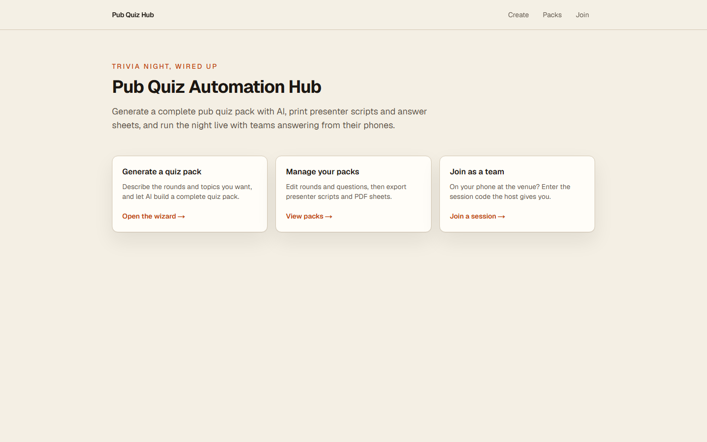
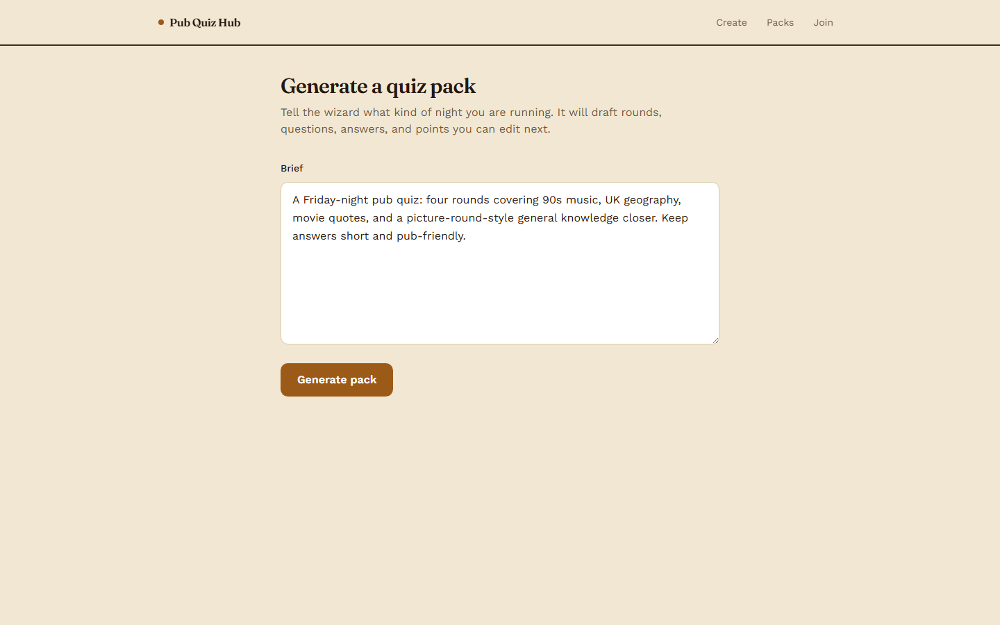
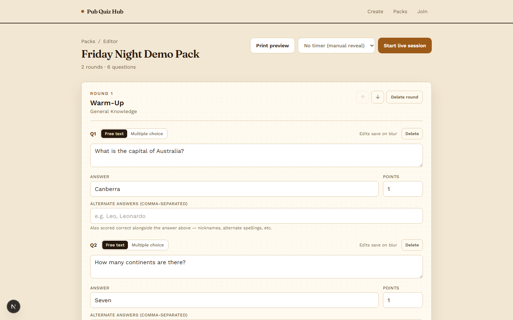
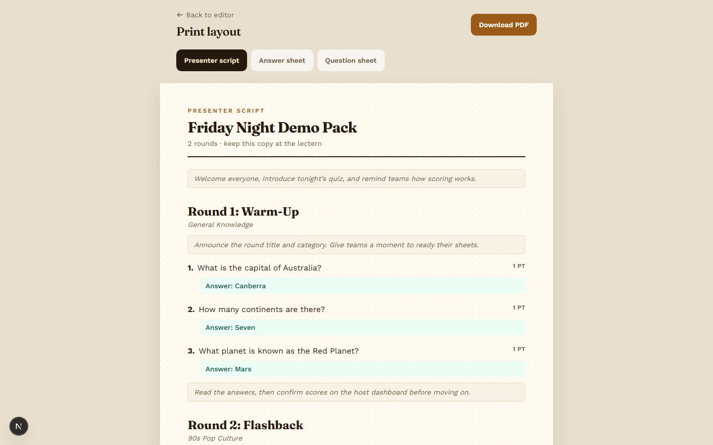
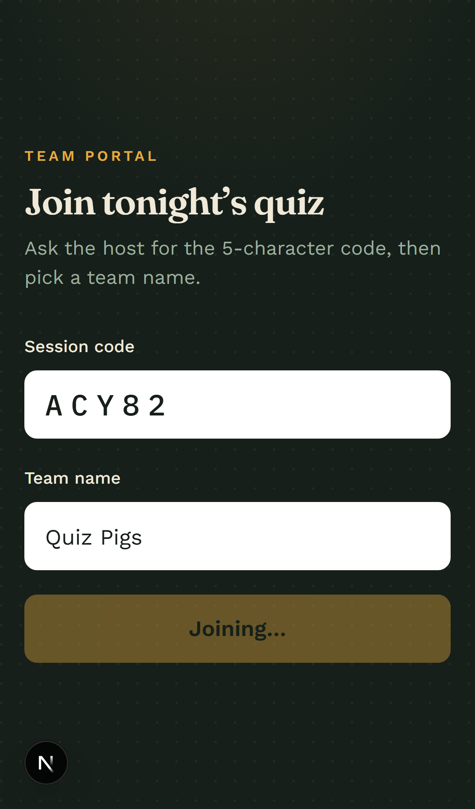
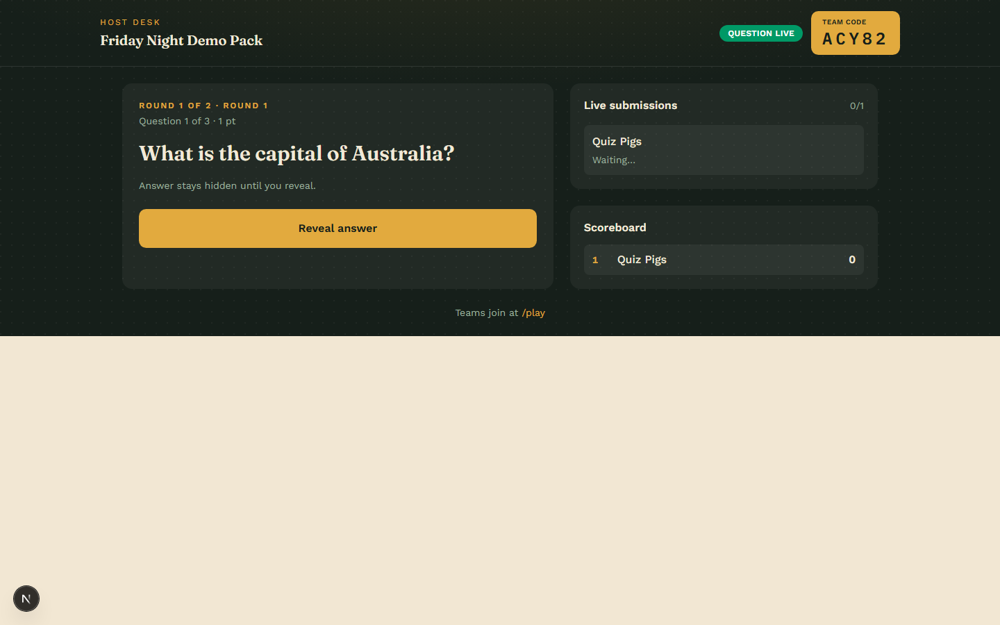
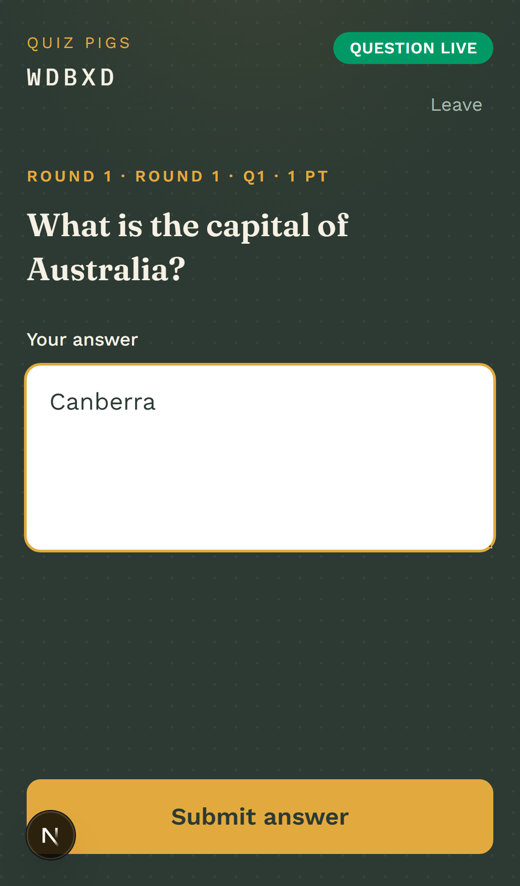
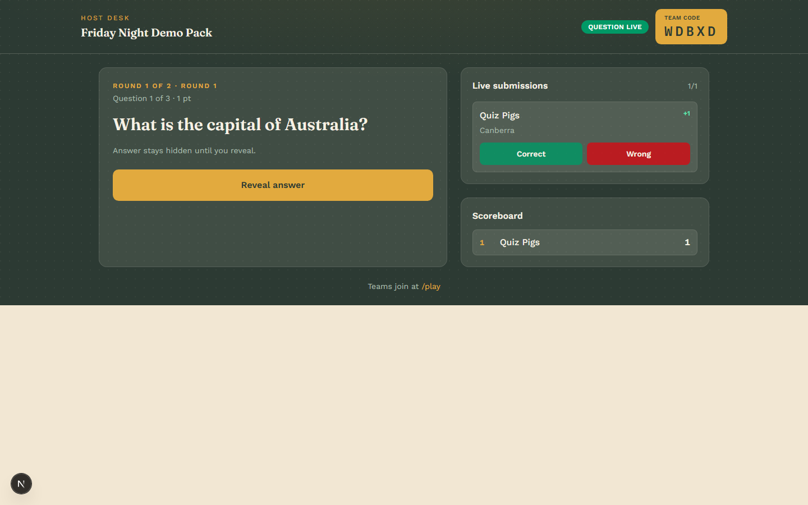
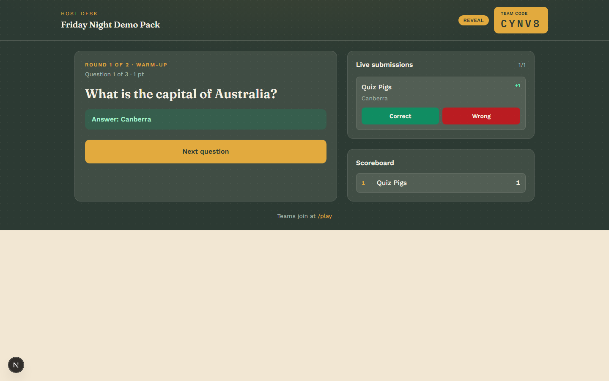
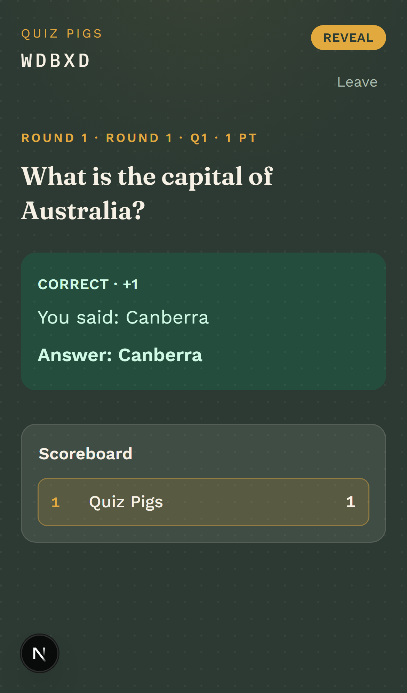

# Pub Quiz / Trivia Night Automation Hub

Generate a complete pub quiz pack with AI, print presenter scripts and PDF
question/answer sheets, and run the night live with teams submitting answers
from their phones.

**Live demo**: https://pub-quiz-trivia-night-automation-hu.vercel.app

## Screenshots

Real, in-browser captures from `npm run screenshots` (Playwright drives an
actual live session end-to-end — nothing here is mocked or hand-edited).

| | |
|---|---|
|  Landing page |  AI generation wizard |
|  Pack editor |  Presenter script / print preview |
|  Host desk — lobby, with a scannable join link |  Team portal — join screen |
|  Host desk — question live |  Team portal — answering |
|  Host desk — live submission, auto-scored |  Host desk — revealed, scoreboard updated |
|  Team portal — reveal, correct + score | |

Regenerate these anytime with `npm run screenshots` (spins up its own
throwaway DB and dev server, so it never touches `prisma/dev.db`).

## Stack

- Next.js (TypeScript, App Router, Tailwind)
- Prisma + SQLite/libSQL (local file for dev, Turso for a real deploy — same
  code either way, see Deployment below)
- Anthropic (Claude) API for quiz generation (structured tool-use output)
- `@react-pdf/renderer` for PDF export
- Vitest for unit tests
- Live team portal via polling (no websockets)

## Setup

```bash
npm install
cp .env.example .env   # then fill in ANTHROPIC_API_KEY
npx prisma migrate dev
npm run dev
```

Open [http://localhost:3000](http://localhost:3000).

## Deployment

The default `.env` setup (a local SQLite file, an in-memory rate limiter) is
right for local dev or a single long-running process, but not for a
serverless host — an ephemeral/read-only filesystem has nowhere to write a
SQLite file, and each invocation can be a fresh cold instance with its own
memory, so neither survives past one request. Both pieces are swappable
purely through environment variables — no code changes:

- **Database**: Prisma connects via a libSQL driver adapter
  (`prisma.config.ts` for the CLI, `src/lib/db.ts` for the app itself), which
  speaks the same protocol against a local file or a real hosted database.
  Create one with [Turso](https://turso.tech) (`turso db create <name>`),
  then set `DATABASE_URL` to its `libsql://...` URL and `DATABASE_AUTH_TOKEN`
  to a token from `turso db tokens create <name>`. Run
  `npx prisma migrate deploy` once against that URL before first traffic.
- **Rate limiting**: set `UPSTASH_REDIS_REST_URL` and
  `UPSTASH_REDIS_REST_TOKEN` (from a free database at
  [Upstash](https://console.upstash.com)) and `src/lib/rate-limit.ts`
  automatically switches from its in-memory fallback to a real shared store,
  so the limit is enforced across every instance instead of resetting per
  cold start.

Leaving either pair of env vars unset keeps today's local-dev behavior
(a `prisma/dev.db` file, an in-process limiter) — both are additive, not a
breaking config change.

No API key yet? `POST /api/packs/seed` creates a small static demo pack so you
can exercise the editor, PDF export, and live session flow without calling
Claude. There's also a CLI seed script: `npm run db:seed`.

## Core flow

1. **Generate** — `/create` sends a free-text brief to
   `POST /api/packs/generate`, which calls Claude (via a forced tool call, so
   the response is schema-validated JSON) and persists the pack via Prisma.
2. **Edit** — `/packs/[id]` lists rounds/questions for inline editing
   (`PATCH /api/questions/[id]`) and links to PDF exports
   (`GET /api/packs/[id]/pdf?type=questions|answers|script`).
3. **Host** — `POST /api/sessions` creates a live session with a short join
   code **and a separate, unguessable host key** (returned once, stored in
   the host's browser). The host dashboard polls
   `GET /api/sessions/[code]?as=host&hostToken=...` and drives the state
   machine via `POST /api/sessions/[code]/advance` (`start` → `reveal` →
   `next`), both requiring that key.
4. **Play** — Teams join with `POST /api/sessions/[code]/join` (returns a
   token), then poll `GET /api/sessions/[code]?token=...` and submit answers
   via `POST /api/sessions/[code]/answers`. Answers are auto-scored by
   normalized exact match; the host can override via
   `PATCH /api/sessions/[code]/answers/[answerId]` (also host-key gated).

Session states: `LOBBY → QUESTION_ACTIVE → REVEAL → (next question or ENDED)`.
Every state transition is an atomic conditional update (`updateMany` guarded
by the exact state it read), so two concurrent advance calls — a double-tap,
a retried request on flaky venue wifi — can't both apply; the loser gets a
409 instead of silently skipping a question.

## Security notes

- **Join code vs. host key**: the join code is handed to every team by
  design, so it can't double as proof of host authority. Session creation
  also returns a separate host key, required on every session-control
  endpoint (`advance`, the answer-score override, and the host view) and
  compared with a constant-time check (`src/lib/host-auth.ts`). The host
  dashboard stores it in `localStorage`; if that's lost (different device,
  cleared storage), `/host/[code]` offers a "paste your host key" recovery
  form rather than a hard lockout.
- **Rate limiting**: `POST /api/packs/generate` (spends real Anthropic API
  credit) and `POST /api/packs/seed` are throttled per-IP
  (`src/lib/rate-limit.ts`) — backed by Upstash Redis when
  `UPSTASH_REDIS_REST_URL`/`UPSTASH_REDIS_REST_TOKEN` are set (see
  Deployment above), or an in-memory, single-instance Map otherwise, which
  is fine for local dev but not a real multi-instance deployment target. It
  keys on `x-forwarded-for`/`x-real-ip`, which a direct caller can set to
  anything — this assumes a trusted reverse proxy in front (e.g. Vercel's
  edge network) that sets those headers itself and doesn't pass through a
  client-supplied value. If this is ever exposed with no such proxy in
  front, the limiter
  offers no real protection; that's a deployment-topology assumption worth
  confirming before going further than this app's current single-operator
  scale.
- **`ADMIN_TOKEN`** (optional, see `.env.example`): if set, `DELETE
  /api/packs/[id]` requires it via an `x-admin-token` header. Nothing in the
  UI calls this route today; it exists to be reachable safely once something
  does. Unset by default for solo local dev.
- These are proportionate to this app's actual trust model — one host
  running one venue's quiz for a room of teams — not a multi-tenant SaaS
  auth system. See [PROMPTS.md](./PROMPTS.md) history / commit messages for
  the fuller threat-model reasoning.

## Testing

```bash
npm run test              # unit tests (scoring, scoreboard, session state machine)
npm run test:integration  # full session-lifecycle tests against a real (throwaway) SQLite DB
npm run test:e2e          # Playwright: real browser, host + team tabs, full UI flow
npx tsc --noEmit          # typecheck
npm run lint
```

`test:integration` spins up `prisma/test.db` (migrated fresh each run, gitignored)
and drives the actual route handlers — create pack → create session → join →
answer → auto-score → reveal → host override → advance through every question
to `ENDED` — plus edge cases like duplicate team names, answering before the
quiz has started, a second answer after the host has revealed, joining
mid-game vs. joining a session that's already ended, and the wizard's
input-validation and unconfigured-API-key paths (`src/test/edge-cases.integration.test.ts`).

Unit tests also cover input-boundary regressions directly — e.g. a
whitespace-only prompt or team name passing a naive `.min(1)` check
(`quiz-schema.test.ts`) and the rate limiter's window/isolation behavior
(`rate-limit.test.ts`).

`test:e2e` runs against `prisma/e2e.db` (own throwaway DB, migrated fresh
by a Playwright global setup) and a dedicated `next dev` on port 4517 that
Playwright starts itself. It drives two real browser contexts (host + team)
through the actual UI: seed a pack via API, open the pack editor, click
"Start live session", join as a team on `/play`, submit an answer, reveal,
and assert the scoreboard updates on both sides.

### Load test

```bash
npm run build && PORT=4933 npm run start        # production build, in one terminal
npm run load-test -- --teams=20 --base=http://localhost:4933   # in another
```

Simulates N teams joining a fresh session and polling every ~3s (like real
phones) while a host driver advances the quiz to completion, printing
latency stats for polls, answer submissions, and host advance calls. Run
against a **production build** (`next start`, not `next dev`) — dev mode's
Turbopack JIT-compiles each route on first hit, so its numbers swing wildly
with cache state and aren't a meaningful baseline either way.

A 20-team run against a production build, after host-key auth and
per-IP rate limiting landed in the request path, completed in ~26s with
p95 poll latency ~118ms and p95 join latency ~496ms — comfortably fine at
this app's target scale. (An earlier dev-mode run had cited p95 poll
latency around 2s; that number was never a fair baseline and shouldn't be
compared against this one — different mode, different warm/cold cache
state, not a real before/after.)

`409 This question is no longer accepting answers` errors are expected — a
team's submit racing the host's reveal — and the UI already surfaces them
as a normal inline error rather than crashing. The *count* of these errors
scales with how fast the server responds relative to the load-test
script's fixed timing constants (`THINK_TIME_MS`, `REVEAL_PAUSE_MS`): a
faster server finishes the simulated night faster, so a fixed-duration
"think time" eats a bigger share of a shorter game, and more teams get
caught mid-answer at reveal. That's an artifact of the simulator's pacing,
not a real-world degradation — real hosts don't reveal on a clock keyed to
server response time.

## CI

`.github/workflows/ci.yml` runs typecheck, lint, unit tests, integration
tests, and the Playwright E2E test on every push/PR — no secrets required
(nothing in the suite calls the real Claude API).

## Known limitations

- SQLite (or Turso/libSQL — see Deployment) is single-writer; fine at this
  app's target scale (tens of teams, one session at a time) but would need
  to move to Postgres for a multi-tenant deployment (low-effort swap via
  Prisma).
- The `hostToken`/`ADMIN_TOKEN` model assumes one operator per deployment,
  not a distributed multi-tenant service — that's unchanged regardless of
  which database/rate-limiter backend is configured.
- `npm audit` reports 3 high-severity findings, all from the same
  dev-time-only chain (`prisma` CLI → `@prisma/config` → `deepmerge-ts`, a
  stack-exhaustion issue). Not reachable by the running app; no fix is
  available yet without moving to an unstable `prisma@8` release candidate.

## Project docs

See [PROMPTS.md](./PROMPTS.md) for the phase-by-phase build playbook,
including which tasks are better suited to Claude Code vs. Cursor.
